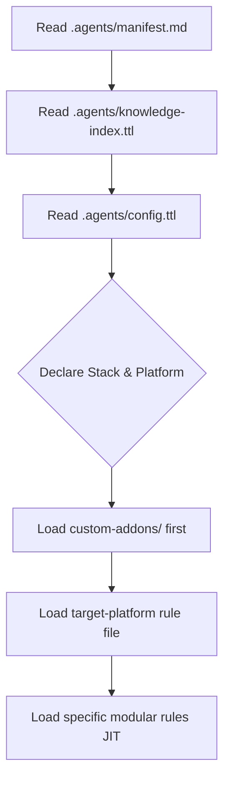

# Episteme AI Rules Manifest

This manifest defines the entry point and hierarchical loading protocol for AI developer agents in the Episteme repository.

## Progressive Loading Protocol

To minimize context window bloat, agents must not load all rules simultaneously. Instead, execute the following loading sequence:

1.  **Step 1: Check Manifest & Knowledge Index:** Verify what W3C specifications are already known (`.agents/knowledge-index.ttl`) to avoid loading redundant spec documents.
2.  **Step 2: Read Config:** Parse the active project config (`.agents/config.ttl`) to discover the core modules, target platform, and custom addons.
3.  **Step 3: Load Custom Addons:** Load any active addons under `custom-addons/`. **These take absolute priority** and can override standard W3C rules.
4.  **Step 4: Load Platform Rules:** Load the active target platform rule file (e.g. `target-platform-01-static-web.mdc`).
5.  **Step 5: Just-In-Time Modular Loading:** Load specific rules files on demand (e.g. only load `solid-auth.mdc` when writing authentication logic).

## Distribution / Loading Modes

*   **local-fs**: Read files from `.agents/rules/` and `custom-addons/` directly on the local filesystem.
*   **solid-native**: Fetches rule configurations as RDF datasets and Markdown snippets from an active Solid Pod container via LDP / shape trees.
